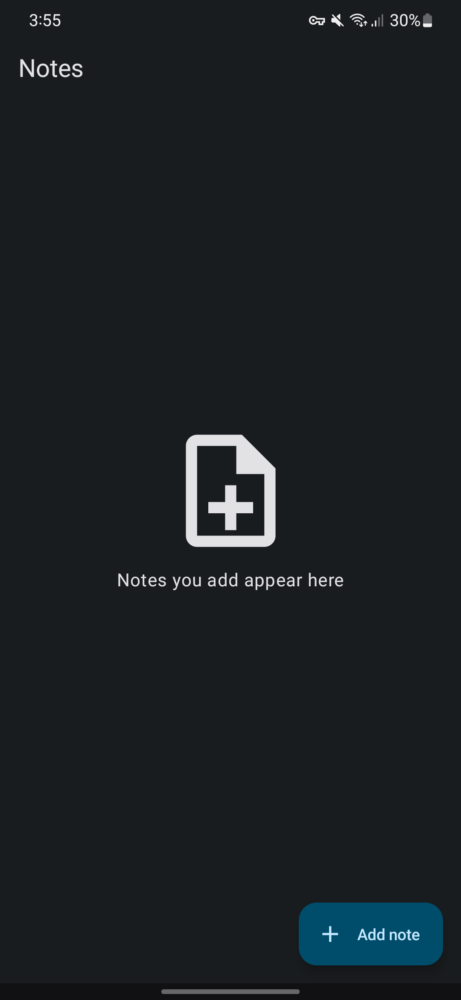
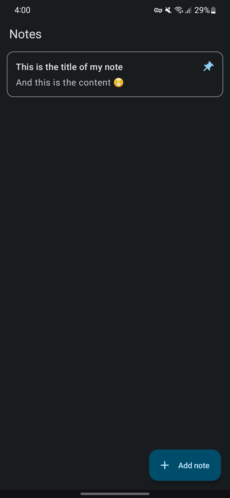
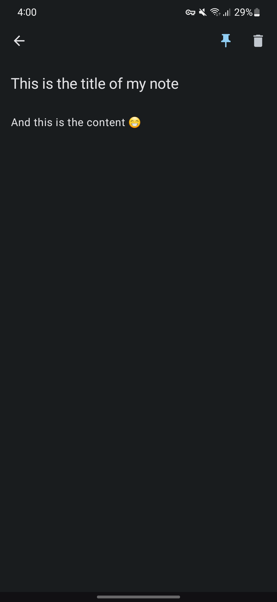

# Overview

This is a native Android application for taking notes. It allows users to create, pin, and delete notes effortlessly.

# Features
- **Add notes**: Users can create new notes by entering a title and content. The app provides a simple and intuitive interface for note creation.
- **Pin notes**: Important notes can be pinned to the top of the list for quick access. This feature helps users prioritize their most essential information.
- **Delete notes**: Unwanted or outdated notes can be easily deleted with a single tap. This functionality ensures a clutter-free and organized note-taking experience.

# Screenshots
|                      Empty notes list                      |                   Notes list                   |                  Edit note                   |
| :--------------------------------------------------------: | :--------------------------------------------: | :------------------------------------------: |
|  |  |  |

# Libraries
- Jetpack Compose with Material 3
- Room
- Dagger Hilt
- Accompanist
- Kotlinx Coroutines
- Jetpack Navigation
- Jetpack Lifecycle

# License
This project is licensed under the MIT License. See the LICENSE file for more details.
